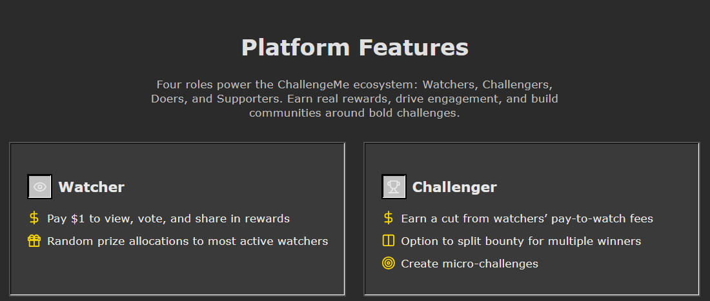
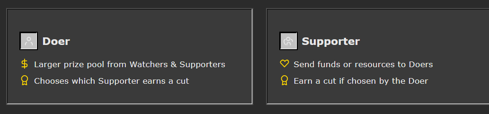
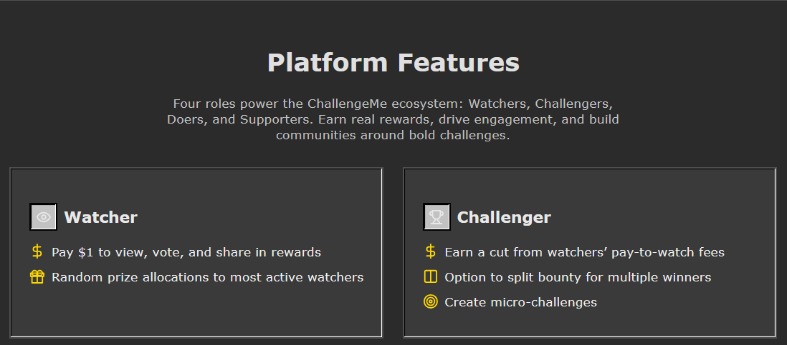
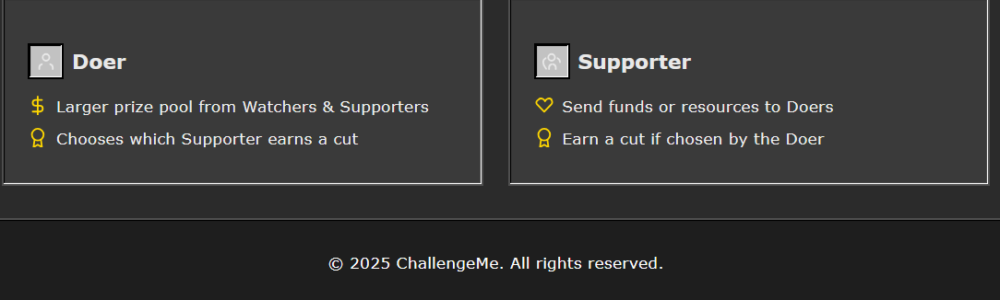
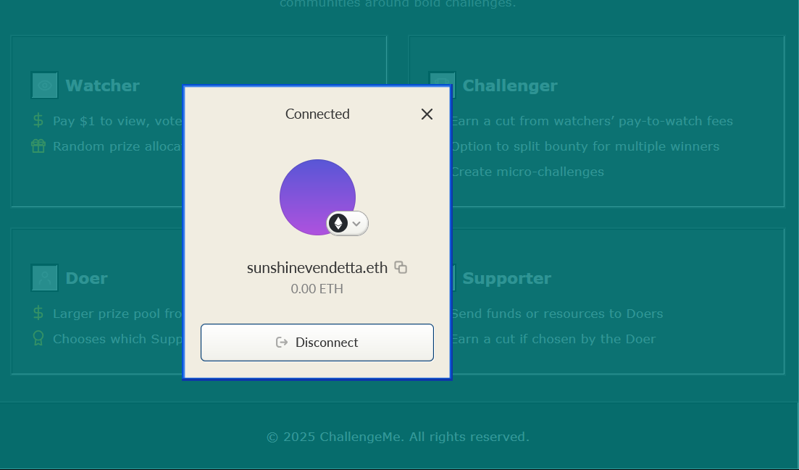

ChallengeMe

## Team Members:
- Sunshine Vendetta (sunshinevendetta.lens)

## Project Description:
Platform Explanation

    Watcher: Pays X amount of Grass or Bonsai to watch, vote, and earn rewards while participating in the challenge dynamic. During the challenge, an AI randomly selects watchers who receive money just for watching, sharing, or voting to decide the winner.

    Challenger: Creates challenges, sets rules, defines rewards, and earns a portion of the money generated by watchers. If their challenges go viral, they earn a percentage of the generated attention in $.

    Doer: Participates in challenges to win prizes and fame. Additionally, they can choose which supporter receives a portion of their prize or keep the entire prize themselves. They must be at least 18 years old at the time of participation and sign a digital waiver confirming their mental capacity to participate. They choose a nickname and are part of the global leaderboard. The more challenges they win, the more $ and extra prizes they receive.

    Supporter: Supports doers with funds, bets (for or against), or resources (financial or human). They can sabotage enemies of their favorite doer to prevent them from winning. Essentially, they send all kinds of help to ensure their doer wins the challenge, increasing their chances of receiving a percentage of the prize.

Main Features

    Anonymous Posting of Bounties: Challenges are posted anonymously and are linked on-chain via my smart contract.
    Mandatory KYC: Participation and claiming prizes require mandatory KYC, but participants use pseudonyms during the competition.
    Real-World Challenges Only: All challenges must be carried out in the real world with evidence submitted as videos via Lens Protocol. These challenges must take place in public, with at least two witnesses present (either accidentally or directly invited) to validate the challenge.
    Dynamic Bounties: If participants fail, the accumulated prize money is added to a larger pool.
    Optional Micro-Challenges: Any watcher or supporter can propose side missions during the main challenge, offering extra money for participants to do more interesting things or increase the difficulty of the main challenge.
    Single or Multiple Winners: Challenges can have one or multiple winners.
    Time-Limited Challenges: Challenges must be completed within a set timeframe. If not, the prize money goes into the larger pool.

Key Rules

    No theft, crimes, or property damage.
    No physical violence or self-inflicted or third-party abuse.
    Only fully consensual participants can participate or appear on screen.
    No challenges involving driving under the influence of substances or alcohol.
    No endangering the safety of others.
    No acts that threaten lives, such as breath-holding challenges.
    All challenges must comply with local and national laws.
    No involvement of animals, even if they are personal pets.

Allowed Ideas

    Absurd but Fun: Challenges should aim to be entertaining
   No minors can be present, involved, or accidentally appear on-screen. Only adults (18+) can participate.
    Focus: The focus is to be fun and safe.

## Source Code Link:
[ChallengeMe GitHub Repository](https://github.com/sunshinevendetta/holiday-hackathon)

## Screenshots (Optional):

